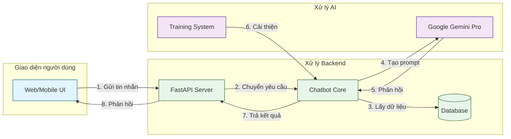
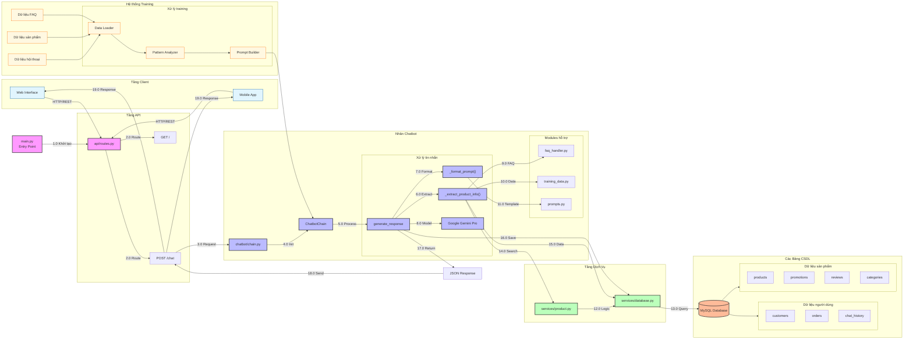

# Order Chatbot

Chatbot thông minh hỗ trợ tư vấn và đặt hàng laptop, được xây dựng với Google Gemini Pro và FastAPI.

## Tính năng chính

- 🤖 Tư vấn sản phẩm laptop thông minh dựa trên nhu cầu và ngân sách
- 💰 Tự động nhận diện khoảng giá từ tin nhắn người dùng
- 🛒 Hỗ trợ đặt hàng và quản lý giỏ hàng
- 🏷️ Tích hợp thông tin khuyến mãi
- 📝 Lưu trữ lịch sử chat
- ❓ Xử lý câu hỏi thường gặp tự động

## Công nghệ sử dụng

- **Backend**: FastAPI
- **Database**: MySQL
- **AI Model**: Google Gemini Pro
- **Frontend**: Giao diện web

## Cấu trúc dự án

```
.
├── src/
│   ├── api/            # Các điểm cuối API
│   ├── chatbot/        # Logic cốt lõi của chatbot
│   ├── services/       # Các dịch vụ xử lý logic
│   └── main.py         # Điểm khởi đầu ứng dụng
├── database/           # Scripts cơ sở dữ liệu
├── web/               # Mã nguồn frontend
├── config/            # File cấu hình
└── training_data/     # Dữ liệu huấn luyện chatbot
```

## Sơ đồ tổng quan



## Sơ đồ chi tiết



## Giải thích chi tiết sơ đồ

### 1. Luồng khởi tạo ứng dụng (Initialization Flow)
- File `main.py` là điểm khởi đầu:
  - Khởi tạo ứng dụng FastAPI và cấu hình cơ bản
  - Thiết lập CORS để cho phép truy cập từ frontend
  - Cấu hình logging để theo dõi hoạt động
  - Khởi tạo kết nối database
  - Load các biến môi trường từ file `.env`
  - Đăng ký các routes và middleware

### 2. Tầng API (API Layer)
- `routes.py` xử lý các endpoints:
  - Endpoint `/chat`:
    - Nhận POST request với JSON body chứa tin nhắn và thông tin người dùng
    - Validate dữ liệu đầu vào
    - Kiểm tra phiên người dùng
    - Chuyển tin nhắn tới chatbot
    - Xử lý lỗi và trả về response phù hợp
  
  - Endpoint `/`:
    - Kiểm tra health check của hệ thống
    - Verify kết nối database
    - Kiểm tra trạng thái các services

### 3. Nhân chatbot (Chatbot Core)
- `ChatbotChain` trong `chain.py`:
  - Khởi tạo và quản lý phiên chat
  - Duy trì context của cuộc hội thoại
  - Tích hợp với Google Gemini Pro

- Quy trình xử lý tin nhắn:
  1. `_extract_product_info()`:
     - Phân tích nội dung tin nhắn
     - Trích xuất thông tin về giá cả
     - Nhận diện sản phẩm được đề cập
     - Tìm kiếm khuyến mãi liên quan
  
  2. `_format_prompt()`:
     - Kết hợp thông tin đã trích xuất
     - Thêm context từ lịch sử chat
     - Áp dụng template phù hợp
     - Tối ưu prompt cho model

  3. Tương tác với các module hỗ trợ:
     - `faq_handler.py`: 
       + Kiểm tra câu hỏi thường gặp
       + Trả về câu trả lời có sẵn nếu phù hợp
     
     - `training_data.py`:
       + Cung cấp dữ liệu huấn luyện
       + Hỗ trợ fine-tuning phản hồi
     
     - `prompts.py`:
       + Quản lý templates
       + Tối ưu format câu trả lời

### 4. Tầng dịch vụ (Services Layer)
- `database.py` - Quản lý database:
  - Xử lý kết nối pool
  - Thực thi các truy vấn SQL
  - Cache kết quả thường dùng
  - Xử lý transaction
  - Backup và recovery
  
- `product.py` - Xử lý sản phẩm:
  - Tìm kiếm theo nhiều tiêu chí
  - Filter và sắp xếp kết quả
  - Kiểm tra tồn kho
  - Tính giá theo khuyến mãi
  - Quản lý metadata sản phẩm

### 5. Tầng cơ sở dữ liệu (Database Layer)
- Cấu trúc các bảng chính:
  1. `customers`:
     - Thông tin cá nhân khách hàng
     - Lịch sử mua hàng
     - Preferences và settings
  
  2. `products`:
     - Chi tiết sản phẩm
     - Thông số kỹ thuật
     - Giá cả và tồn kho
     - Hình ảnh và mô tả
  
  3. `orders`:
     - Thông tin đơn hàng
     - Trạng thái và lịch sử
     - Chi tiết thanh toán
  
  4. `chat_history`:
     - Lưu toàn bộ cuộc hội thoại
     - Context và metadata
     - Thời gian và trạng thái
  
  5. `promotions`:
     - Các chương trình khuyến mãi
     - Điều kiện áp dụng
     - Thời gian hiệu lực

### 6. Luồng phản hồi (Response Flow)
1. Xử lý kết quả từ model:
   - Parse response từ Gemini Pro
   - Format theo cấu trúc chuẩn
   - Thêm metadata cần thiết

2. Tạo JSON Response:
   - Cấu trúc dữ liệu phản hồi
   - Thêm thông tin bổ sung
   - Xử lý lỗi nếu có

3. Gửi về client:
   - Trả về qua API endpoint
   - Cập nhật lịch sử chat
   - Ghi log giao dịch

### 7. Xử lý lỗi và bảo mật
- Các cơ chế xử lý lỗi:
  - Validate input/output
  - Retry mechanism
  - Fallback responses
  - Error logging

- Các biện pháp bảo mật:
  - API authentication
  - Rate limiting
  - SQL injection prevention
  - Data encryption

### 8. Performance và Scaling
- Tối ưu hiệu năng:
  - Database indexing
  - Query optimization
  - Response caching
  - Connection pooling

- Khả năng mở rộng:
  - Horizontal scaling
  - Load balancing
  - Microservices architecture
  - Distributed caching

## Quy trình xử lý chi tiết

1. **Khởi động ứng dụng** (`main.py`):
   - Khởi tạo ứng dụng FastAPI
   - Thiết lập CORS và middleware
   - Đăng ký các đường dẫn

2. **Xử lý yêu cầu** (`api/routes.py`):
   - Tiếp nhận yêu cầu từ người dùng
   - Kiểm tra tính hợp lệ của dữ liệu
   - Chuyển yêu cầu tới ChatbotChain

3. **Xử lý Chatbot** (`chatbot/chain.py`):
   - Tạo phiên ChatbotChain mới
   - Trích xuất thông tin từ tin nhắn (giá cả, sản phẩm)
   - Tạo prompt với ngữ cảnh
   - Gọi API Google Gemini Pro
   - Lưu lại lịch sử trò chuyện

4. **Tầng dịch vụ**:
   - `database.py`: Thực hiện các truy vấn MySQL
   - `product.py`: Xử lý tìm kiếm và lọc sản phẩm

5. **Tầng cơ sở dữ liệu**:
   - Quản lý thông tin người dùng
   - Quản lý danh mục sản phẩm
   - Theo dõi lịch sử trò chuyện
   - Quản lý chương trình khuyến mãi

## Yêu cầu hệ thống

- Python 3.8 trở lên
- MySQL 8.0 trở lên

## Hướng dẫn cài đặt

1. Tải mã nguồn:
```bash
git clone <đường-dẫn-repository>
cd order-chatbot
```

2. Tạo môi trường ảo và cài đặt thư viện:
```bash
python -m venv .venv
source .venv/bin/activate  # Linux/Mac
# hoặc
.venv\Scripts\activate     # Windows
pip install -r requirements.txt
```

3. Thiết lập cơ sở dữ liệu:
```bash
mysql -u root -p < database/schema.sql
mysql -u root -p < database/sample_data.sql
```

4. Cấu hình môi trường:
- Tạo file `.env` từ mẫu `.env.example`
- Cập nhật các thông số cần thiết

5. Chạy ứng dụng:
```bash
uvicorn src.main:app --reload
```

## Các điểm cuối API

- `POST /chat`: Điểm cuối chính để tương tác với chatbot
- `GET /`: Kiểm tra trạng thái hoạt động

## Cấu trúc cơ sở dữ liệu

- `customers`: Thông tin khách hàng
- `products`: Thông tin sản phẩm
- `categories`: Danh mục sản phẩm
- `orders` & `order_items`: Đơn hàng và chi tiết
- `cart` & `cart_items`: Giỏ hàng
- `chat_history`: Lịch sử trò chuyện
- `promotions`: Thông tin khuyến mãi

## Tính năng Chatbot

1. **Tư vấn sản phẩm**:
   - Phân tích nhu cầu người dùng
   - Đề xuất sản phẩm phù hợp
   - Tự động nhận diện khoảng giá

2. **Xử lý đơn hàng**:
   - Thêm sản phẩm vào giỏ hàng
   - Quản lý đơn hàng
   - Áp dụng khuyến mãi

3. **Tương tác thông minh**:
   - Xử lý ngôn ngữ tự nhiên
   - Trả lời câu hỏi thường gặp
   - Lưu trữ ngữ cảnh cuộc trò chuyện

## Bảo mật

- Middleware CORS
- Mã hóa mật khẩu người dùng
- Xử lý lỗi an toàn
- Hệ thống ghi log

## Đóng góp

Vui lòng đọc [CONTRIBUTING.md](CONTRIBUTING.md) để biết thêm chi tiết về quy trình đóng góp.

## Giấy phép

Dự án này được phân phối dưới giấy phép MIT. Xem file [LICENSE](LICENSE) để biết thêm chi tiết. 